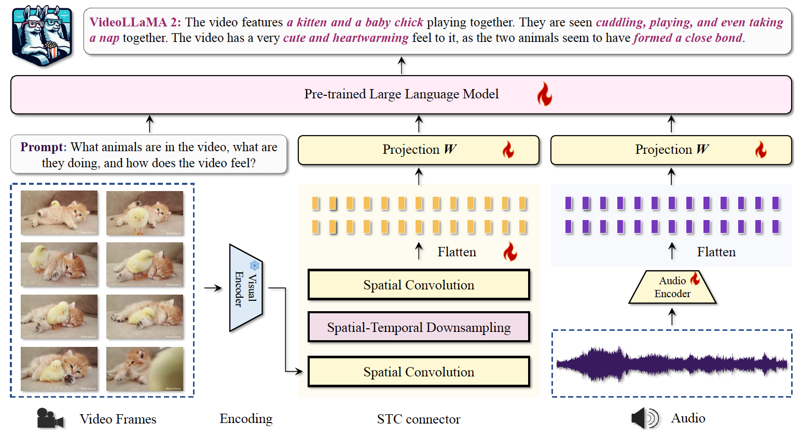

# Emotional FusionBrain Challenge 4.0

<div align="center"></div>

<div align="center">
 


  
</div>

## Содержание
- [Oписание задачи](#общее-описание-задачи-)  
- [Данные](#данные)
- [Описание формата решения](#описание-формата-решения-)
- [Метрики](#метрики)
- [Ограничения](#ограничения-)
- [Baseline решение](#baseline-решение-)
- [Данные для обучения](#данные-для-обучения-)
- [Призовой фонд](#призовой-фонд-)
- [Специальная номинация](#специальная-номинация)


## Oписание задачи   

В настоящее время мультимодальные модели стремительно развиваются, демонстрируя впечатляющее качество в задачах анализа изображений и аудио. Однако задача понимания видео все еще представляет сложность для современных моделей, так как требует интеграции текста, изображений, звука и времени. Создание моделей, способных успешно понимать длинные видео, будет востребовано пользователями, позволяя им получать краткие выжимки из просмотренного материала. Более того, фокус на видео, содержащих записи социальных взаимодействий, способствует лучшему погружению модели в социальный контекст, это ведет к улучшенному пониманию AI ассистентом внешних эмоциональных проявлений и поведения людей. Суммаризация такого рода видеозаписей и, как следствие, способность модели отвечать на вопросы по ним, позволит создать новый виток в развитии виртуальных ассистентов.
В рамках данного соревнования участникам предстоит разработать универсальную мультимодальную модель для работы с видео, аудио и текстом. Каждой видеозаписи будет сопутствовать ряд вопросов по ходу развития сюжета и действий объектов/людей на записи, по ответам на которые будет определяться, насколько успешно модель справилась с «просмотром» и пониманием содержания. Видеозапись может содержать также и аудио контент, который должен помочь ответить модели на вопросы.

В качестве **первой дополнительной номинации** предлагается применить разработанную мультимодальную модель к видеозаписям популярной интеллектуальной стратегической игры для топ-10 команд на итоговом лидерборде. На основе видео модель должна ответить на вопросы по игре, определить роли участников игры и выяснить по видеозаписи кто из них говорит неправду. Чем больше правильных ответов у модели, тем выше ее позиция в рейтинге по первой дополнительной номинации.

Кроме того, вводится **вторая дополнительная номинация** для топ-10 Команд на итоговом лидерборде по основной номинации, в рамках которой оценивается время инференса решения. Меньшему времени инференса соответствует более высокая позиция в рейтинге по второй дополнительной номинации.


## Данные

### Входные данные

Все объекты тестового датасета разделяются по типу задачи, которую требуется решить. Задача может быть одной из двух типов:      
      
**Captioning** - это тип задачи, который потребует детального описания видео. Для решения такого типа задач потребуется сгенерировать текстовый ответ-описание видеозаписи.       
      
**Question Answering (QA)** - это тип задачи, который потребует ответа на вопрос с выбором ответа по контенту видеозаписи. В данном случае, модели будет необходимо выбрать наиболее подходящий вариант ответа из предоставленных.      

Датасет состоит из семплов, каждый из которых представляет собой словарь, в котором определены следующие поля:      
* **task_id** - (тип: int) обозначает уникальный идентификатор вопроса;      
* **task_type** - (тип: str) обозначает тип задачи, может быть один из опций:       
  * *captioning* - тип задачи детального описания видеозаписи. В этом типе в поле question будет содержаться промпт для описания видеозаписи, а поле choices будет содержать пустой список вариантов ответа.       
  * *qa* - тип задачи ответа на вопрос по видеозаписи. В этом типе в поле question будет содержать текстовый вопрос, а поле choices будет находиться список из вариантов ответа.       
* **question** - (тип: str) содержит в себе вопрос к видеозаписи;      
* **video** - (тип: str) описывает путь к файлу видеозаписи;      
* **audio** - (тип: str) описывает путь к файлу аудиозаписи, заполнен не во всех задачах;      
* **choices** - (тип: list) поле содержит список вариантов ответа на данный вопрос.       
В свою очередь, каждый вариант ответа представляет собой словарь следующей структуры (значения заполнены в качестве примера):       
```{'choice_id': 1, 'choice': 'value'}```, где ```'choice_id'``` - порядковый индекс варианта ответа, а ```'choice'``` - непосредственное значение варианта ответа.      
      
**Пример:**      
 ```json
 {      
    'task_id': 1,     
    'task_type': 'qa',    
    'question': 'Who is dancing in the end of the video?',      
    'video': 'path_to_video.mp4',     
    'audio': 'path_to_audio.mp3',  
 'choices': [       {'choice_id': 1, 'choice': 'Woman in red'},     
       {'choice_id': 2, 'choice': 'Woman in blue'},     
       {'choice_id': 3, 'choice': 'Man in green'},   
       {'choice_id': 4, 'choice': 'Man in black'},     
       {'choice_id': 5, 'choice': 'Nobody'},     
    ]    
 }      
 {      
   'task_id': 2,     
   'task_type': 'captioning',     
   'question': 'Describe this video in detail.',     
   'video': 'path_to_video.mp4',     
   'audio': '',   
'choices': [] } 
```   

Видеозаписи, по которым нужно сделать предсказания, размещены в папке *video*. Внутри лежат файлы видео в формате *.mp4*.  
  
Аудиозаписи размещены в папке *audio*.  Внутри лежат файлы видео в формате *.mp3*.  


### Выходные данные

Выходные файлы, в которых хранятся предсказания модели должны сохраняться в директорию `output_path_from_job`, которая автоматически создается в корне решения.

Решение должно собирать предсказания в два файла в зависимости от типа задачи, представленного в семпле данных: Captioning или Question Answering (QA).

* в файл `./output_path_from_job/for_generative_metric.json` для задачи детального описания видео (Captioning);
* в файл `./output_path_from_job/for_classification_metric.json` для задачи ответа на вопросы по видео (Question Answering (QA)). В качестве значений ответов указывается **индекс правильного ответа** из предоставленных вариантов ответов, начиная с 0 и заканчивая индексом 4;

Каждый из вышеприведенных файлов имеет следующую структуру:

```json
{
  "task_id": prediction
}
```

Пример для задачи детального описания видео (Captioning):
```json
{
  0: "Video shows ...",
  3: "Here we see ..."
}
```

Пример для задачи ответа на вопросы по видео (Question Answering (QA)):
```json
{
  1: 1,
  2: 4,
  4: 0
}
```


## Описание формата решения

В проверяющую систему необходимо отправить код, запакованный в ZIP-архив. 
Решения запускаются в изолированном окружении при помощи Docker. Время и ресурсы во время тестирования ограничены.
Размер загружаемого решения не должен превышать 5 Гб.

Для запуска решений необходимо использовать уже существующее окружение. Dockerfile и requirements для данного образа приведены на вкладке Данные на [официальной страничке соревнования](https://dsworks.ru/champ/emotional-fusionbrain#overview).

Обратите внимание, окружение, в котором запускается решение, не имеет доступ в Интернет. 
Таким образом, мы рекомендуем следущие шаги для комплектации вашего решения: 

* Все необходимые библиотеки, которых нет в базовом образе, прелагается загружать в архиве решения и устанавливать из кода. 
* Веса моделей небольшого размера, которые удовлетворяют суммарному ограничению по объему решения в 5 Гб, могут загружаться в самом решении.
* Варианты весов некоторых крупных мультимодальных моделей для анализа изображений, видео и аудио уже помещены в базовый образ. Список загруженных моделей и пути к ним приведены в [таблице](./PATHS.md).

Структура самого решения четко не регламентирована. Необходимо только, что бы в корне решения был создан скрит `run.py`, который будет запускаться в окружении организаторами соревнования. 

Точка входа для запуска бейзлайна файл `run.py`. Он предполагает следующую сигнатуру запуска:

```
python run.py --input_path 'path-to-test-dataset.json'
```

Формат выходных данных скрипта `run.py` подробно описан в секции `Выходные данные`.


## Метрики
Для оценки решений участников предлагается использовать **две метрики: генеративную и классификационную метрику**.

Качество ответов на вопросы с выбором варианта ответа (из предложенных вариантов) предлагается оценивать с помощью **классификационной метрики Accuracy** (доля правильных ответов), которая основывается на внутренней оценке уверенности модели в вариантах ответа на вопрос по видеозаписи. Участникам предлагается, в рамках вычисления данной метрики, рассчитать численные значение перплексии модели в ответ на входные варианты ответа на вопрос. Затем, на основе данных значений осуществить выбор наиболее вероятного, с точки зрения оцениваемой модели, варианта ответа. На выходе решение участника должно выдать номер выбранного варианта ответа. Финальным значением метрики будет доля правильно отвеченных вопросов (выбранный вариант ответа совпадает с правильным) относительно общего числа вопросов (Accuracy).

Качество ответов на вопросы без выбора варианта ответа (открытая генерация) или вопросы, направленные на описание видео, оценивается с помощью **генеративной метрики METEOR**. 

Финальный результат участника и распределение мест будет оцениваться в соответствии с **интегральной метрикой**. <br>

Подробное описание метрик и их расчета можно почитать [тут](./METRICS.md).

## Ограничения
В течение одних суток Участник или Команда Участников может загрузить для оценки не более 3 (трёх) решений. Учитываются только валидные попытки, получившие численную оценку. Если при расчете хотя бы одной метрики возникло исключение, решение считается невалидным, и счетчик попыток не уменьшается.

Контейнер с решением запускается в следующих условиях:

* 243 Gb RAM

* 16 CPU-cores

* 1 GPU Tesla A100 (80 Гб)

* время на выполнение решения: 3,5 часа

* решение не имеет доступ к ресурсам интернета

* ограничение на суммарный вес загружаемого решения 5 Гб.

## Baseline решение
В основе бейзлайна лежит мультимодальная модель [VideoLLaMA-2](https://github.com/DAMO-NLP-SG/VideoLLaMA2).

<div align="center"></div>

## Данные для обучения

Специальные данные для обучения модели мы не предоставляем под задачу. 
Тем не менее, мы рекомендуем вам список актуальных датасетов для дообучения вашего решения [тут](./DATASETS.md)

## Определение победителей    
Топ-10 решений определяются на основе приватного лидерборда, сформированного при подсчете интегральной метрики $\text{I}$ (чем выше $\text{I}$, тем выше рейтинг).  
  
### Первая дополнительная номинация “Ролевая игра”  

В качестве **первой дополнительной номинации** предлагается применить разработанную мультимодальную модель к видеозаписям ролевой игры для топ-10 Участников или Команд Участников,  определенных после завершения этапа приема решений и указанных на приватном лидерборде по основной номинации.  На основе видео на входе модель должна будет ответить на вопросы по течению игры, определить роли участников и вероятность правдоподобности тезисов, озвучиваемых и демонстрируемых игроками. Чем больше правильных ответов у модели, тем выше ее позиция в рейтинге по первой дополнительной номинации.  
  
В рамках этой номинации разработанные Участниками модели будут оценены по классификационной метрике **Accuracy** (доля правильных ответов), которая основывается на внутренней оценке уверенности модели в вариантах ответа на вопрос по видеозаписи и рассчитывается аналогично основной номинации.  
  
### Вторая  дополнительная номинация  “Самое быстрое решение”    
  
Помимо первой дополнительной номинации для Задачи вводится **вторая дополнительная номинация** для топ-10 Участников или Команд Участников,  определенных после завершения этапа приема решений и указанных на приватном лидерборде по основной номинации. В рамках этой номинации разработанные Участниками модели будут оценены по метрике наименьшего времени инференса $T$, которое рассчитывается следующим образом:   
    
$$T=\frac{1}{N}\sum_{i=1}^{N}\tau_i,$$    
    
 где $\tau_i$  –  время инференса для задачи $i$,  в секундах; $N$  –  количество задач.  
  
## Призовой фонд  

  * Первое место – 1 000 000 рублей    
* Второе место – 700 000 рублей     
* Третье место – 400 000 рублей     
* Доп. номинация 1 – 200 000 рублей    
* Доп. номинация 2 – 200 000 рублей    
  
Суммы указаны до вычета НДФЛ.
